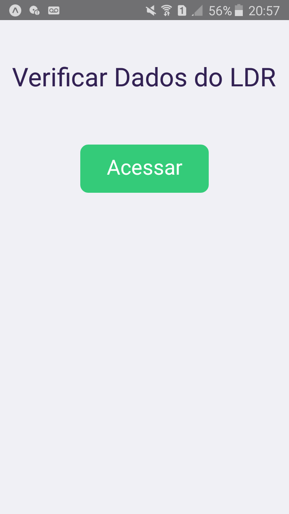
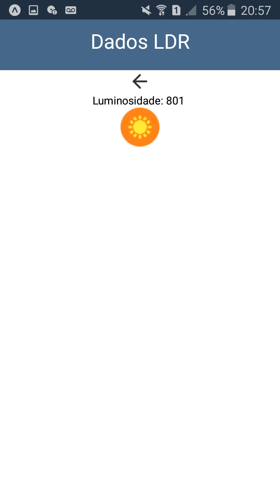
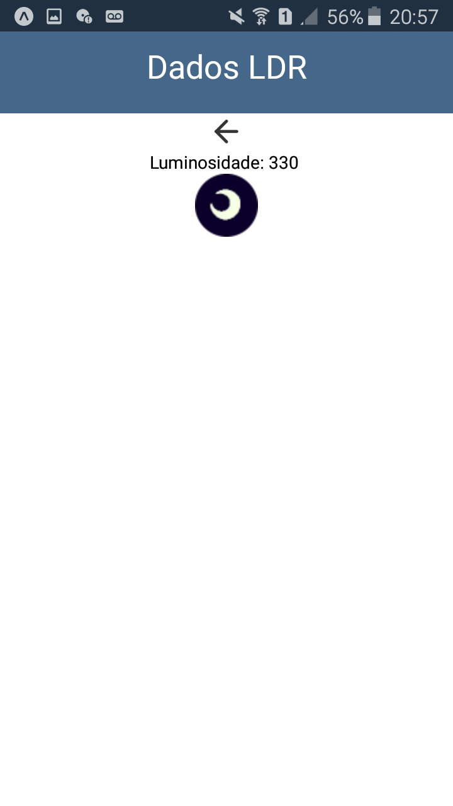

# Arduino Mobile
Versão móvel do projeto arduino web. Aplicativo que recebe dados do monitor serial de um arduino. 

  
  
  

## Requisitos
    Instalar o Git
    https://git-scm.com/downloads

    Instalar o NodeJs
    https://nodejs.org/en/

    Installar o Expo CLI
    https://docs.expo.io/get-started/installation/

    Instalar IDE do Arduino
    https://www.arduino.cc/en/Main/Software

## Primeiro passo - baixar o projeto
Faça download do repositório acima ou use o seguinte comando na pasta onde deseja baixar o projeto:
 - git clone https://github.com/AloisioFernandes/arduino-mobile.git

## Segundo passo - fazer upload do arquivo para arduino
Abra a pasta arduino-ldr e faça upload do arquivo arduinoLDR.ino para sua placa arduino. A porta analógica utilizada é A2, se estiver utilizando uma porta diferente altere a linha 1 desse código.

## Terceiro passo - instalar dependências
Digite o seguinte comando dentro das pastas mobile e server através do terminal:
 - npm install

## Quarto passo - configurar servidor
Abra a pasta server e acesse o arquivo server.js. Verifique a linha 13 do código. Se necessário, altere '/dev/ttyACM0' para a porta USB em que sua placa arduino está conectada.Ex:
 - const port = new SerialPort('/dev/ttyACM1')

Ainda dentro da pasta, inicie o servidor com o comando:
 - node server.js

## Quinto passo - configurar aplicativo
Acesse o arquivo index.tsx que está em mobile/src/pages/Dados e verifique a linha 11. Altere o conteúdo da função SocketIOClient('') informando o endereço de ip e a porta em que o servidor está conectado. Ex:
 - const socket = SocketIOClient('http://192.168.1.117:3001')

## Sexto passo - iniciar app
Dentro da pasta mobile, digite o seguinte comando no terminal: 
 - expo start

Ao executar esse comando, uma página abrirá no seu navegador web. Utilize o aplicativo do expo para abrir o app através do QRCode da página web.